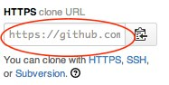
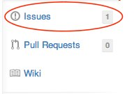

Susimoda - Web Site
===================

> This project has the objective of to create a static website with the same design and contents of the currently published.

###Clone from GitHub

If is your first time we suggest to **read this turorial** [Cloning an Existing Repository](http://git-scm.com/book/en/Git-Basics-Getting-a-Git-Repository#Cloning-an-Existing-Repository)

http://git-scm.com/book/en/Git-Basics-Getting-a-Git-Repository#Cloning-an-Existing-Repository

###Run locally

To visualize the project, during the development, we suggest to use a **web server**. 

http-server is a **NodeJS** command and you need to download this platform from the official web site: [NodeJS]( http://nodejs.org/).

http://nodejs.org/
 
  
Launch the **Terminal** programm in the folder of the project and write this command:

    npm install 
    
    sudo npm install -g http-server 
    
Runn this command **only the first time** when you need to install the web server. For this operation is request the password of system.

After this you can write the command to launch the **web server**:

    http-server
 

This default configuration run an HTTP Server available at:

    http://localhost:8080

I can read the complete **tutorial** on: [Movebleapp.com](http://movableapp.com/2014/03/quick-nodejs-http-server/)

http://movableapp.com/2014/03/quick-nodejs-http-server/

###How to add issues 

A stackeholder can write issues on GitHub web site to report a problem or bug.

Every issue have a ID number preceded by the symbol **#**.  
When the team fixed one issue the stackeholder can see the issue as **closed**.
 

